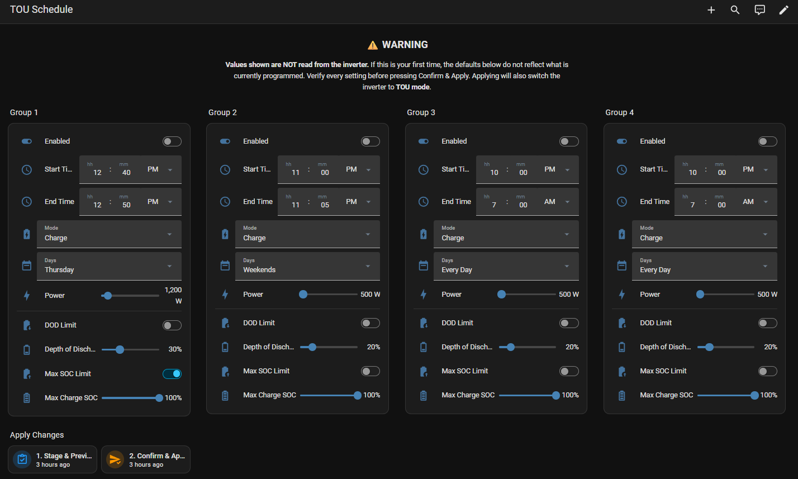
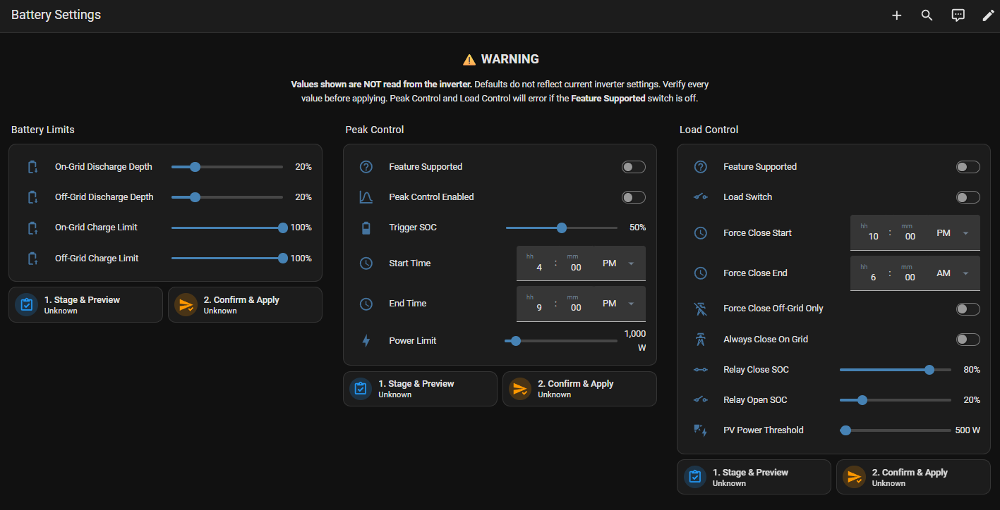

# Dyness Battery – Cygni Control (Personal Fork)

[](https://github.com/aistuartai/dyness_battery_stu/releases)
[](LICENSE)
[](https://github.com/hacs/integration)

> **Personal fork** of [shopf/dyness_battery](https://github.com/shopf/dyness_battery), extended with full inverter control for the **Dyness Cygni 10.0HS-M8** (and Cygni HS series generally).
>
> Tested on a single setup. Use at your own risk. For a stable, multi-device integration use the upstream repo.

---

## What this fork adds

On top of all upstream sensors, this fork adds **write control** via the Dyness v2 API — configuring the inverter directly from Home Assistant without touching the Dyness app.

All settings use a **two-step Stage → Confirm** flow to prevent accidental writes to live hardware. Staging shows a persistent notification preview of the proposed changes before anything is sent to the inverter.

### Configurable Polling Interval

Set how often HA polls the Dyness cloud API — configurable at setup and at any time via **Settings → Integrations → Dyness Battery → Configure**.

| Option | Calls/hour (1 module) | Notes |
|--------|----------------------|-------|
| 2 min | ~40 | Aggressive — monitor logs for 429 errors |
| 3 min | ~27 | Recommended for 1 module |
| **5 min** | ~16 | **Default** |
| 10 min | ~8 | Conservative |
| 15 min | ~5 | Minimum recommended for 3+ modules |

With 3+ modules the interval is automatically raised (to 10 or 15 min) regardless of your setting, to stay within the Dyness API rate limit of ~60 calls/hour.

Changing the interval triggers an automatic integration reload — no HA restart needed.

### TOU (Time of Use) Schedule

Configure up to **4 charge/discharge groups** entirely within HA:

| Control | Options |
|---------|---------|
| Enabled | On / Off per group |
| Start / End Time | Time picker |
| Mode | Charge / Discharge |
| Days | Every Day, Weekdays, Weekends, Mon–Sun individually |
| Power Limit | 0 – 10,000 W (100 W steps) |
| DOD Limit | Enable switch + 0–100% slider |
| Max Charge SOC | Enable switch + 0–100% slider |

> **Note:** The Dyness API has no read-back endpoint for TOU schedules. Values shown are what HA last sent — they are restored across restarts via `RestoreEntity`. A warning is shown on the dashboard.



### Battery Limits

| Setting | Range |
|---------|-------|
| On-Grid Discharge Depth | 0–100% |
| Off-Grid Discharge Depth | 0–100% |
| On-Grid Charge Limit | 0–100% |
| Off-Grid Charge Limit | 0–100% |

### Peak Control *(feature-gated)*

Enable only if your inverter supports peak shaving (toggle the **Feature Supported** switch first):

| Setting | Options |
|---------|---------|
| Peak Control Enabled | On / Off |
| Trigger SOC | 0–100% |
| Time Range | Start + End time |
| Power Limit | 0–10,000 W |

### Load Control *(feature-gated)*

Enable only if a load relay is connected (toggle the **Feature Supported** switch first):

| Setting | Options |
|---------|---------|
| Load Switch | On / Off |
| Force Close Window | Start + End time |
| Force Close Off-Grid Only | On / Off |
| Always Close On Grid | On / Off |
| Relay Close SOC | 0–100% |
| Relay Open SOC | 0–100% |
| PV Power Threshold | 0–10,000 W |



---

## Dashboards

Both dashboards use the HA `type: sections` layout with a full-width warning header.

### TOU Schedule dashboard

```yaml
views:
  - type: sections
    title: TOU Schedule
    sections:
      - type: grid
        column_span: 4
        cards:
          - type: markdown
            content: >
              ## ⚠️ WARNING

              **Values shown are NOT read from the inverter.** If this is your
              first time, the defaults below do not reflect what is currently
              programmed. Verify every setting before pressing Confirm & Apply.
              Applying will also switch the inverter to **TOU mode**.
      - type: grid
        title: Group 1
        cards:
          - type: tile
            entity: switch.garage_dyness_cygni_tou_g1_enabled
          - type: tile
            entity: time.garage_dyness_cygni_tou_g1_start
          - type: tile
            entity: time.garage_dyness_cygni_tou_g1_end
          - type: tile
            entity: select.garage_dyness_cygni_tou_g1_mode
          - type: tile
            entity: select.garage_dyness_cygni_tou_g1_days
          - type: tile
            entity: number.garage_dyness_cygni_tou_g1_power
          - type: tile
            entity: switch.garage_dyness_cygni_tou_g1_dod_enabled
          - type: tile
            entity: number.garage_dyness_cygni_tou_g1_dod
          - type: tile
            entity: switch.garage_dyness_cygni_tou_g1_soc_max_enabled
          - type: tile
            entity: number.garage_dyness_cygni_tou_g1_soc_max
      - type: grid
        title: Group 2
        cards:
          - type: tile
            entity: switch.garage_dyness_cygni_tou_g2_enabled
          - type: tile
            entity: time.garage_dyness_cygni_tou_g2_start
          - type: tile
            entity: time.garage_dyness_cygni_tou_g2_end
          - type: tile
            entity: select.garage_dyness_cygni_tou_g2_mode
          - type: tile
            entity: select.garage_dyness_cygni_tou_g2_days
          - type: tile
            entity: number.garage_dyness_cygni_tou_g2_power
          - type: tile
            entity: switch.garage_dyness_cygni_tou_g2_dod_enabled
          - type: tile
            entity: number.garage_dyness_cygni_tou_g2_dod
          - type: tile
            entity: switch.garage_dyness_cygni_tou_g2_soc_max_enabled
          - type: tile
            entity: number.garage_dyness_cygni_tou_g2_soc_max
      - type: grid
        title: Group 3
        cards:
          - type: tile
            entity: switch.garage_dyness_cygni_tou_g3_enabled
          - type: tile
            entity: time.garage_dyness_cygni_tou_g3_start
          - type: tile
            entity: time.garage_dyness_cygni_tou_g3_end
          - type: tile
            entity: select.garage_dyness_cygni_tou_g3_mode
          - type: tile
            entity: select.garage_dyness_cygni_tou_g3_days
          - type: tile
            entity: number.garage_dyness_cygni_tou_g3_power
          - type: tile
            entity: switch.garage_dyness_cygni_tou_g3_dod_enabled
          - type: tile
            entity: number.garage_dyness_cygni_tou_g3_dod
          - type: tile
            entity: switch.garage_dyness_cygni_tou_g3_soc_max_enabled
          - type: tile
            entity: number.garage_dyness_cygni_tou_g3_soc_max
      - type: grid
        title: Group 4
        cards:
          - type: tile
            entity: switch.garage_dyness_cygni_tou_g4_enabled
          - type: tile
            entity: time.garage_dyness_cygni_tou_g4_start
          - type: tile
            entity: time.garage_dyness_cygni_tou_g4_end
          - type: tile
            entity: select.garage_dyness_cygni_tou_g4_mode
          - type: tile
            entity: select.garage_dyness_cygni_tou_g4_days
          - type: tile
            entity: number.garage_dyness_cygni_tou_g4_power
          - type: tile
            entity: switch.garage_dyness_cygni_tou_g4_dod_enabled
          - type: tile
            entity: number.garage_dyness_cygni_tou_g4_dod
          - type: tile
            entity: switch.garage_dyness_cygni_tou_g4_soc_max_enabled
          - type: tile
            entity: number.garage_dyness_cygni_tou_g4_soc_max
      - type: grid
        title: Apply Changes
        cards:
          - type: tile
            entity: button.garage_dyness_cygni_stage_preview_tou
          - type: tile
            entity: button.garage_dyness_cygni_confirm_apply_tou
```

### Battery Settings dashboard

```yaml
views:
  - type: sections
    title: Battery Settings
    sections:
      - type: grid
        column_span: 3
        cards:
          - type: markdown
            content: >
              ## ⚠️ WARNING

              **Values shown are NOT read from the inverter.** Defaults do not
              reflect current inverter settings. Verify every value before
              applying. Peak Control and Load Control will error if the
              **Feature Supported** switch is off.
      - type: grid
        title: Battery Limits
        cards:
          - type: tile
            entity: number.garage_dyness_cygni_battery_on_grid_dod
          - type: tile
            entity: number.garage_dyness_cygni_battery_off_grid_dod
          - type: tile
            entity: number.garage_dyness_cygni_battery_charge_limit
          - type: tile
            entity: number.garage_dyness_cygni_battery_off_grid_charge_limit
          - type: tile
            entity: button.garage_dyness_cygni_stage_preview_battery
          - type: tile
            entity: button.garage_dyness_cygni_confirm_apply_battery
      - type: grid
        title: Peak Control
        cards:
          - type: tile
            entity: switch.garage_dyness_cygni_peak_supported
          - type: tile
            entity: switch.garage_dyness_cygni_peak_enabled
          - type: tile
            entity: number.garage_dyness_cygni_peak_trigger_soc
          - type: tile
            entity: time.garage_dyness_cygni_peak_start
          - type: tile
            entity: time.garage_dyness_cygni_peak_end
          - type: tile
            entity: number.garage_dyness_cygni_peak_power
          - type: tile
            entity: button.garage_dyness_cygni_stage_preview_peak
          - type: tile
            entity: button.garage_dyness_cygni_confirm_apply_peak
      - type: grid
        title: Load Control
        cards:
          - type: tile
            entity: switch.garage_dyness_cygni_load_supported
          - type: tile
            entity: switch.garage_dyness_cygni_load_switch
          - type: tile
            entity: time.garage_dyness_cygni_load_force_close_start
          - type: tile
            entity: time.garage_dyness_cygni_load_force_close_end
          - type: tile
            entity: switch.garage_dyness_cygni_load_force_close_off_grid_only
          - type: tile
            entity: switch.garage_dyness_cygni_load_always_close_on_grid
          - type: tile
            entity: number.garage_dyness_cygni_load_relay_close_soc
          - type: tile
            entity: number.garage_dyness_cygni_load_relay_open_soc
          - type: tile
            entity: number.garage_dyness_cygni_load_pv_power_threshold
          - type: tile
            entity: button.garage_dyness_cygni_stage_preview_load
          - type: tile
            entity: button.garage_dyness_cygni_confirm_apply_load
```

---

## Installation (this fork)

1. In HACS → **Integrations** → **⋮** → **Custom repositories**
2. Add: `https://github.com/aistuartai/dyness_battery_stu` — Category: **Integration**
3. Install **Dyness Battery - Cygni Control**, restart HA
4. **Settings** → **Devices & Services** → **Add Integration** → search **Dyness Battery - Cygni**
5. Enter your **API ID** and **API Secret** from [ems.dyness.com](https://ems.dyness.com/login) → Developer Center → API Management

---

## Known quirks

| Issue | Detail |
|-------|--------|
| API boolean inversion | PDF documents `0=On, 1=Off` but actual API is `0=Off, 1=On` for all on/off fields |
| No TOU read-back | `/v2/GetWorkModeSetting` does not exist — entities persist last-sent values via `RestoreEntity` |
| `time.py` stdlib collision | HA platform named `time.py` shadows Python stdlib — coordinator uses `asyncio.get_event_loop().time()` instead of `time.monotonic()` |
| Peak/Load feature gates | These features are not available on all inverter configurations — enable the **Feature Supported** switch only if your hardware supports it |

---

## Credits

All core architecture, API handling, schema detection, and multi-device support is the work of **[shopf](https://github.com/shopf/dyness_battery)**. This fork adds Cygni-specific sensor patches and the full write-control layer on top.

---

## License

MIT — see [LICENSE](LICENSE). Original copyright © shopf.
